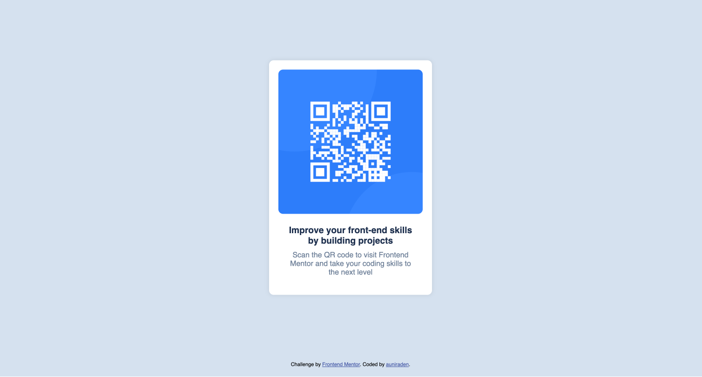

# Frontend Mentor - QR code component solution

This is a solution to the [QR code component challenge on Frontend Mentor](https://www.frontendmentor.io/challenges/qr-code-component-iux_sIO_H). Frontend Mentor challenges help me to improve my coding skills by building realistic projects.

## Table of contents

- [Overview](#overview)
  - [Screenshot](#screenshot)
  - [Links](#links)
- [My process](#my-process)
  - [Built with](#built-with)
  - [What I learned](#what-i-learned)
  - [Useful resources](#useful-resources)
- [Author](#author)

## Overview
This project is a solution to a Frontend Mentor challenge that involved coding a QR code component based on a provided design. The main task was to create a simple, responsive layout using HTML and CSS, ensuring the QR code component is centered both vertically and horizontally on the webpage. Techniques like flexbox were used for alignment and positioning. The project served as a great opportunity to practice fundamental frontend skills, refresh knowledge of web layout techniques, and accurately implement design specifications. The challenge was completed in about an hour, offering a fun and engaging experience.

### Screenshot

### Links

- Solution URL: [Github](https://github.com/auniraden/qr-code-component-main)
- Live Site URL: [Livesite](https://auniraden.github.io/qr-code-component-main/)

## My process
1. Understanding the design: Reviewed the provided design in Figma to identify the layout, spacing, and style requirements.
2. Setting up the project:  Edit the provided project folder structure, including HTML, CSS, and image files.
### Built with

- Semantic HTML5 markup
- CSS custom properties
- Flexbox
- [Styled Components](./assets/styles.css) - For styles

### What I learned

This project provided a valuable refresher in coding based on design specifications, allowing me to practice translating a static design into responsive, functional HTML and CSS. I reinforced my knowledge of layout techniques, particularly using flexbox for centering elements, while also refining my understanding of general web development principles. It felt rewarding to successfully implement the design and gain confidence in my ability to handle design-to-code challenges efficiently

### Useful resources

- [MDN Web Docs](https://developer.mozilla.org/en-US/) - Throughout the project, MDN Web Docs served as a helpful reference whenever I needed to refresh my knowledge of specific HTML and CSS properties. MDN provides clear, detailed documentation and examples, making it an invaluable resource for web development best practices and syntax guidance.

## Author

- Find me - [auniraden](https://www.linkedin.com/in/auniraden/)
- Frontend Mentor - [@auniraden](https://www.frontendmentor.io/profile/auniraden)
